# Frontend Mentor - Arch Studio Website

This is a solution to the [Arch Studio multi-page website challenge on Frontend Mentor](https://www.frontendmentor.io/challenges/arch-studio-multipage-website-wNIbOFYR6). Frontend Mentor challenges help you improve your coding skills by building realistic projects.

## Table of contents

- [Overview](#overview)
  - [The challenge](#the-challenge)
  - [Screenshot](#screenshot)
  - [Links](#links)
- [My process](#my-process)
  - [Built with](#built-with)
  - [Project Structure](#project-structure)
  - [What I learned](#what-i-learned)
  - [Continued development](#continued-development)
  - [Useful resources](#useful-resources)
- [Author](#author)
- [Acknowledgments](#acknowledgments)

## Overview

### The challenge

Users should be able to:

- View the optimal layout for each page depending on their device's screen size
- See hover states for all interactive elements throughout the site
- Receive an error message when the contact form is submitted if:
  - The `Name`, `Email` or `Message` fields are empty should show "Can't be empty"
  - The `Email` is not formatted correctly should show "Please use a valid email address"
- **Bonus**: View actual locations on the contact page map. The addresses we have on the design are fictional, so you'll need to add real addresses for this bonus task.

### Screenshot

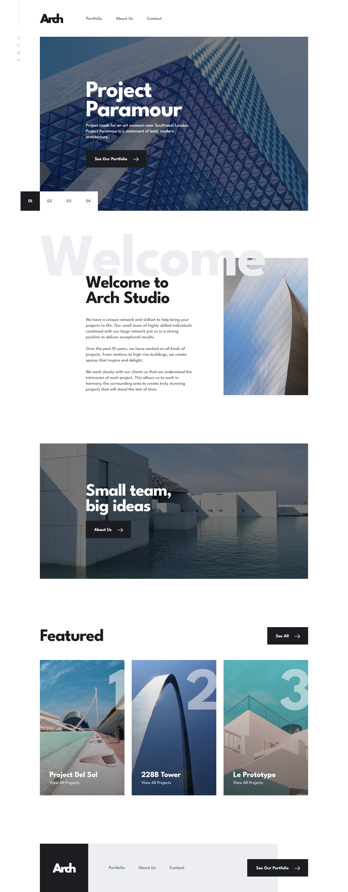

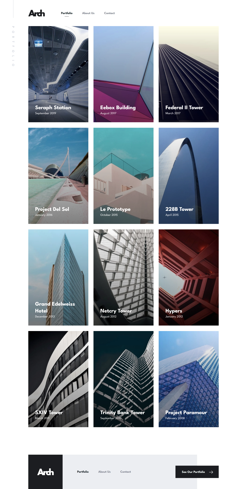

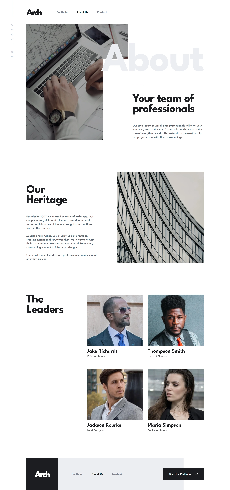

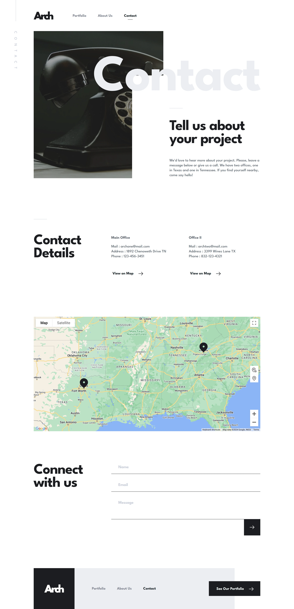

<table>
  <tr>
    <td align="center">Tablet-1</td>
    <td align="center">Tablet-2</td>
  </tr>
  <tr>
    <td>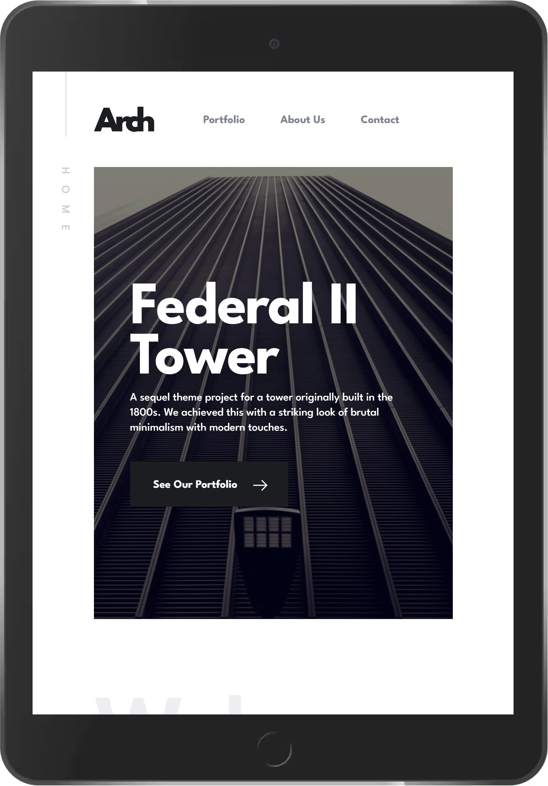</td>
    <td>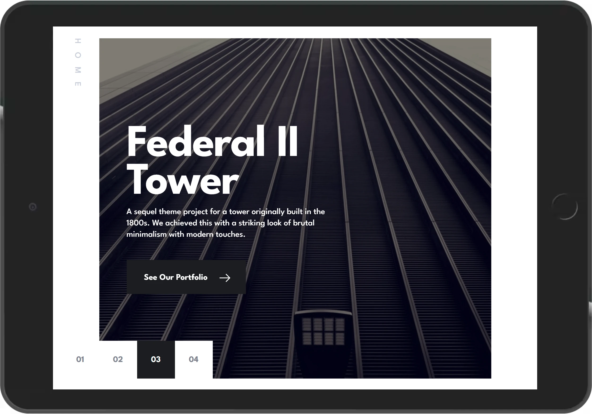</td>
  </tr>
</table>

<table>
  <tr>
    <td align="center">Tablet-3</td>
    <td align="center">Tablet-4</td>
  </tr>
  <tr>
    <td>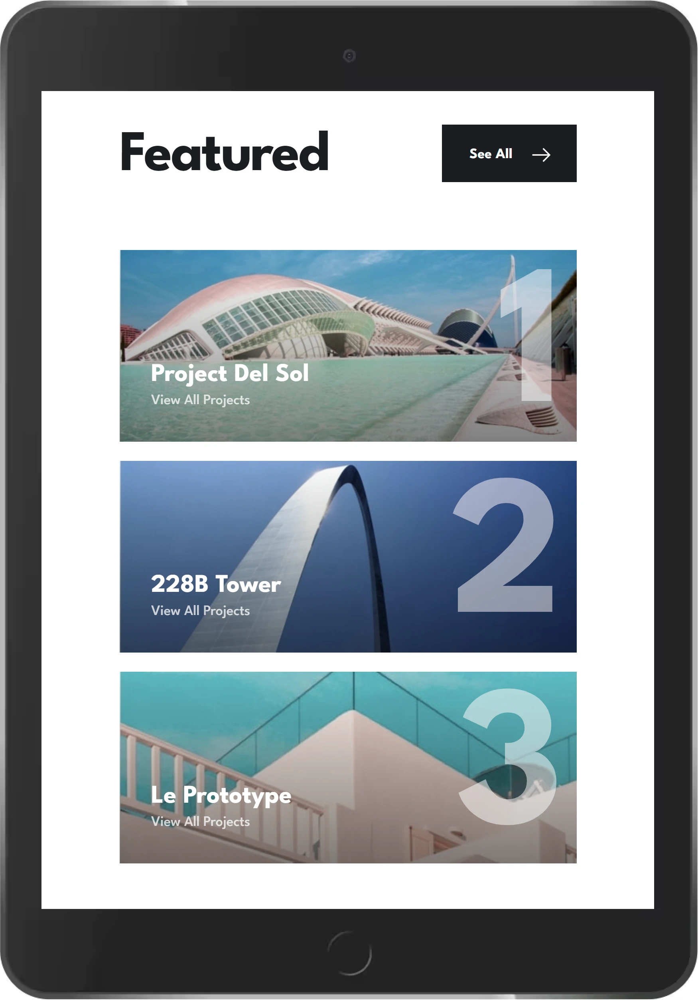</td>
    <td>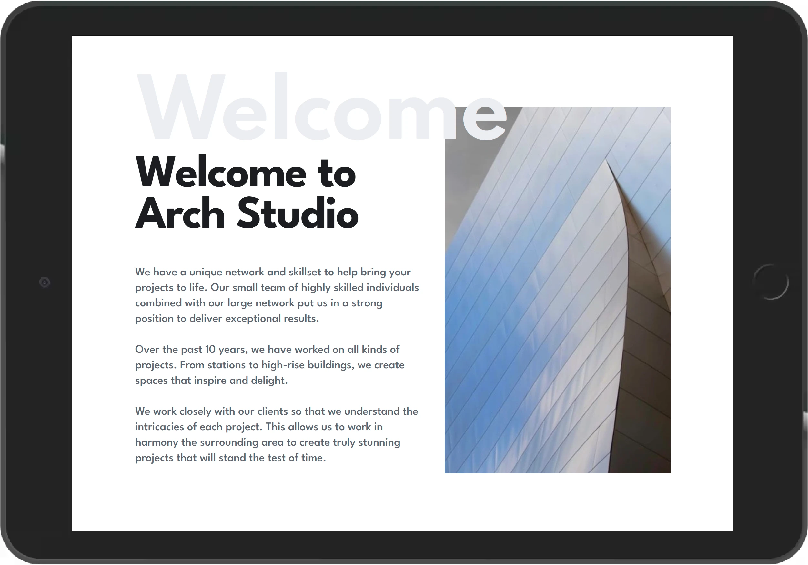</td>
  </tr>
</table>

<table>
  <tr>
    <td align="center">Tablet-5</td>
    <td align="center">Tablet-6</td>
  </tr>
  <tr>
    <td>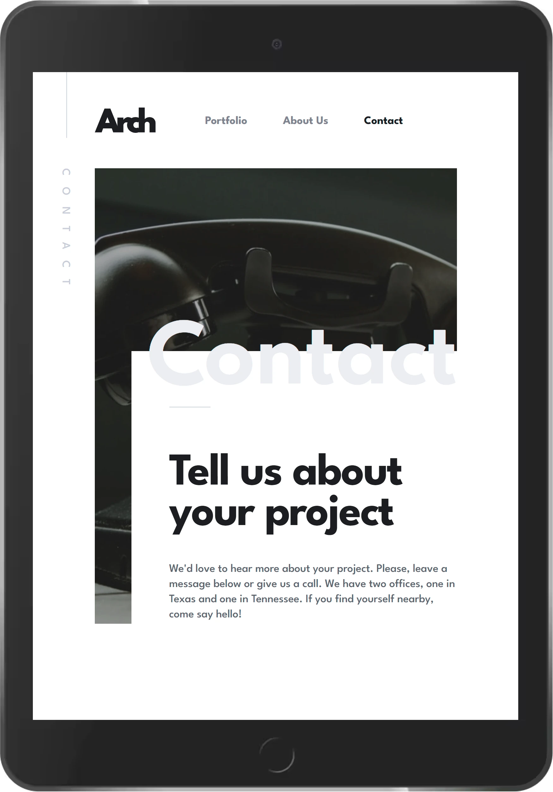</td>
    <td>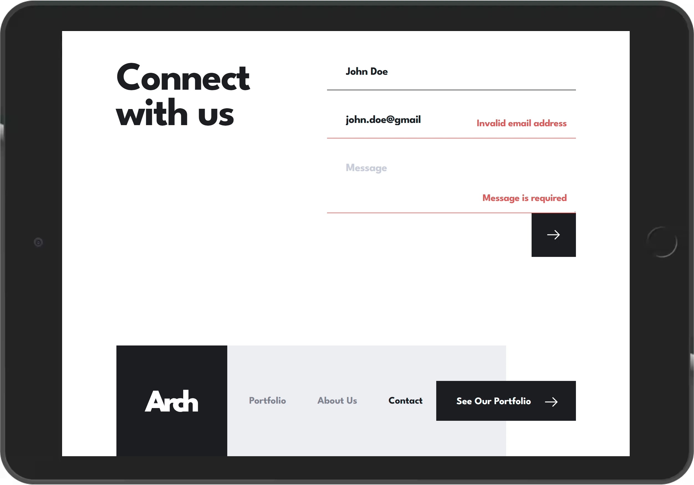</td>
  </tr>
</table>

<table>
  <tr>
    <td align="center">Tablet-7</td>
    <td align="center">Tablet-8</td>
  </tr>
  <tr>
    <td>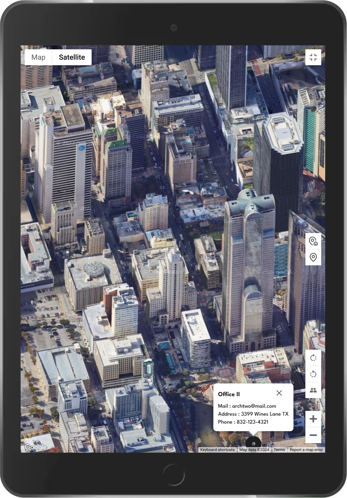</td>
    <td>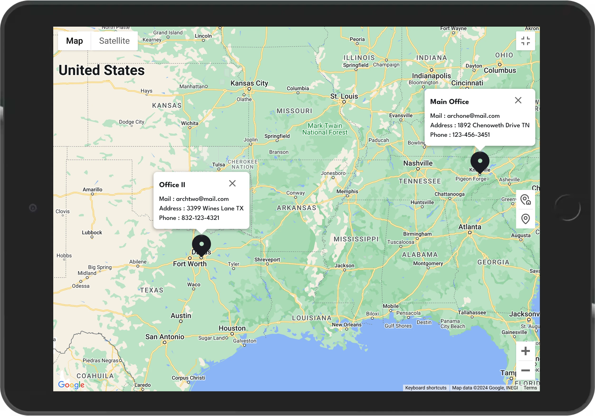</td>
  </tr>
</table>

<table>
  <tr>
    <td align="center">Mobile-1</td>
    <td align="center">Mobile-2</td>
    <td align="center">Mobile-3</td>
    <td align="center">Mobile-4</td>
  </tr>
  <tr>
    <td>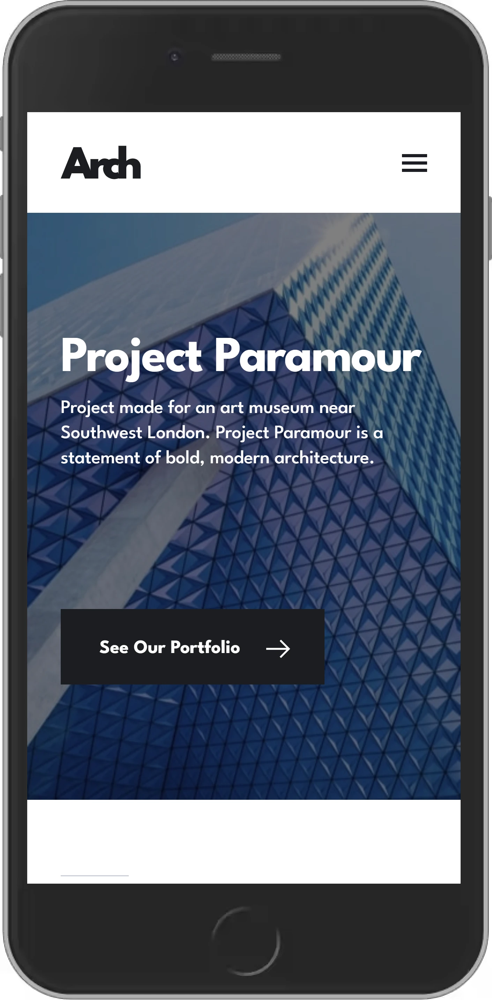</td>
    <td>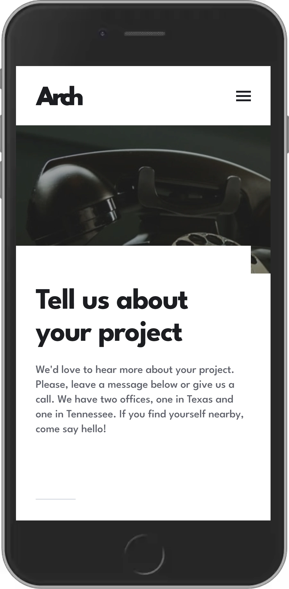</td>
    <td>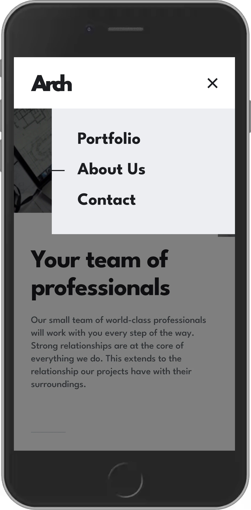</td>
    <td>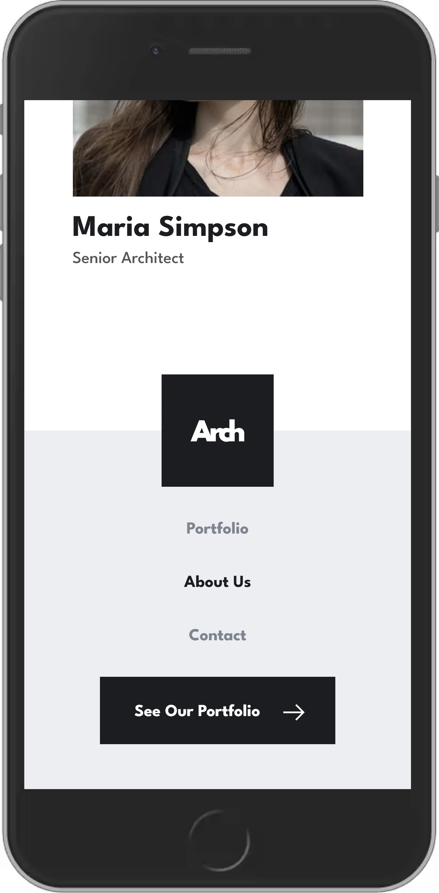</td>
  </tr>
</table>

<table>
  <tr>
    <td align="center">Mobile-5</td>
    <td align="center">Mobile-6</td>
    <td align="center">Mobile-7</td>
  </tr>
  <tr>
    <td></td>
    <td>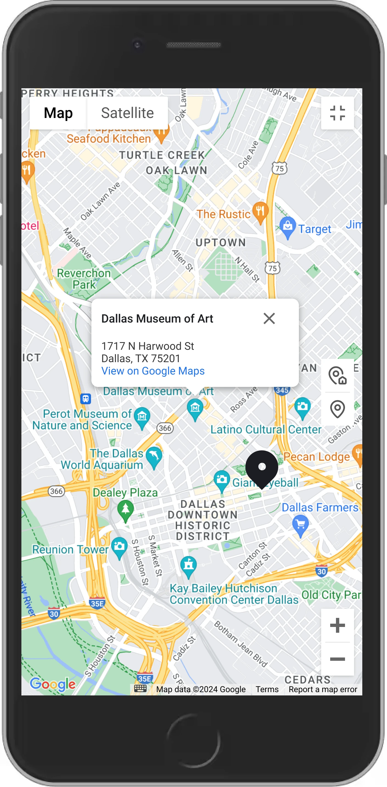</td>
    <td>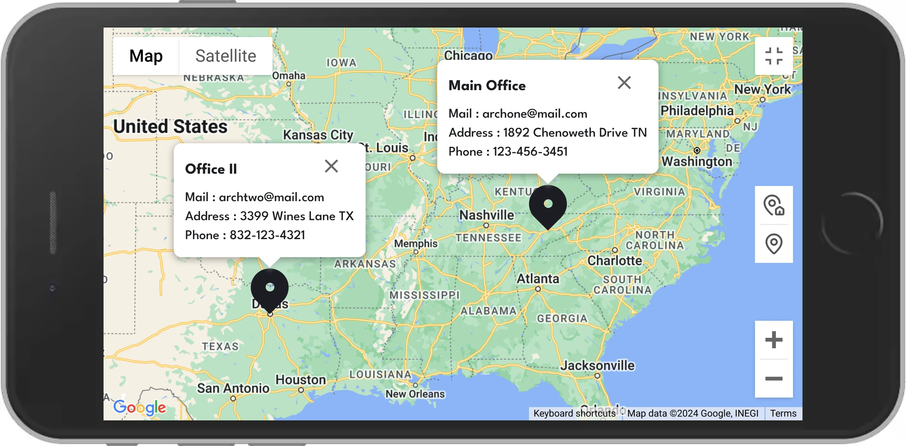</td>
  </tr>
</table>

### Links

- Challenge URL: [Arch Studio website challenge on Frontend Mentor](https://www.frontendmentor.io/challenges/arch-studio-multipage-website-wNIbOFYR6)
- Live Site URL: [Arch Studio website solution on Vercel](https://kerem-gurbuz-fm-arch-studio-website.vercel.app)

## My process

### Built with

#### Core Technologies:

- [Next.js | TypeScript](https://nextjs.org/) - A React framework that provides server-side rendering and other advanced features for building modern web applications.
- [Shadcn/ui](https://ui.shadcn.com/) - A collection of reusable UI components built with Tailwind CSS, providing a consistent and visually appealing user interface.
- [Tailwind CSS](https://tailwindcss.com/) - A utility-first CSS framework that allows you to rapidly build custom user interfaces.
- [React Hook Form](https://react-hook-form.com/) - A performant and flexible form handling library that simplifies form management and validation.
- [Zod](https://zod.dev/) - A TypeScript-first schema validation library that helps ensure data integrity and type safety.

#### Additional Libraries and Tools:

- [@vis.gl/react-google-maps](https://visgl.github.io/react-google-maps/) - For Google Maps integration with React
- [zod-validation-error](https://github.com/causaly/zod-validation-error) - For better Zod validation error messages
- [isomorphic-dompurify](https://github.com/kkomelin/isomorphic-dompurify) - For sanitizing HTML and preventing XSS attacks
- [schema-dts](https://github.com/google/schema-dts) - For adding Schema.org JSON-LD structured data

### Project Structure

```
src/
├───📁 app/                             # Next.js app directory - core application routing and pages
│   ├───📁 about/                       # About page route
│   ├───📁 contact/                     # Contact page route
│   ├───📁 portfolio/                   # Portfolio page route
│   ├───📄 error.tsx                    # Global error boundary component
│   ├───📄 favicon.ico                  # Website favicon
│   ├───📄 global-error.tsx             # Global error handling component
│   ├───📄 layout.tsx                   # Root layout component for the entire application
│   ├───📄 manifest.ts                  # Web app manifest configuration
│   ├───📄 not-found.tsx                # 404 Not Found page component
│   ├───📄 page.tsx                     # Home/landing page component
│   ├───📄 robots.ts                    # Robots.txt configuration for SEO
│   └───📄 sitemap.ts                   # Sitemap generation for SEO
│
├───📁 components/                      # Reusable React components
│   ├───📁 about/                       # Components specific to the About page
│   │   ├───📁 heritage-section/            # Heritage section components
│   │   ├───📁 hero-section/                # About page hero section components
│   │   ├───📁 leaders-section/             # Leaders section components
│   │   └───📄 index.ts                 # Barrel export for About page components
│   │
│   ├───📁 common/                      # Shared, generic components used across the app
│   │
│   ├───📁 contact/                     # Components specific to the Contact page
│   │   ├───📁 contact-details/             # Contact details and Google Maps components
│   │   ├───📁 contact-form/                # Contact form implementation
│   │   ├───📁 hero-section/                # Contact page hero section
│   │   └───📄 index.ts                 # Barrel export for Contact page components
│   │
│   ├───📁 home/                        # Components for the Home/landing page
│   │   ├───📁 featured-projects/           # Featured projects section
│   │   ├───📁 hero-section/                # Home page hero section
│   │   ├───📁 welcome-section/             # Welcome/introduction section
│   │   └───📄 index.ts                 # Barrel export for Home page components
│   │
│   ├───📁 layout/                      # Layout-related components
│   │   ├───📁 footer/                      # Footer component and related
│   │   ├───📁 header/                      # Header and navigation components
│   │   └───📄 index.ts                 # Barrel export for layout components
│   │
│   ├───📁 portfolio/                   # Components for the Portfolio page
│   │   ├───📄 portfolio-grid.tsx           # Grid layout for projects
│   │   └───📄 portfolio-modal.tsx          # Modal for project details
│   │
│   └───📁 ui/                          # Shadcn/ui components and base UI elements
│
├───📁 config/                          # Configuration files
│   ├───📁 seo/                         # SEO-related configurations
│   │   ├───📁 metadata/                    # Page metadata configurations
│   │   └───📁 schema/                      # JSON-LD schema configurations
│   ├───📄 env.ts                       # Environment variable configurations
│   └───📄 navigation.ts                # Navigation-related constants
│
└───📁 lib/                             # Utility functions, hooks, and core library code
    ├───📁 constants/                   # Constant values and configurations
    ├───📁 hooks/                       # Custom React hooks
    ├───📁 styles/                      # Global styles and font management
    ├───📁 types/                       # TypeScript type definitions
    └───📁 utils/                       # Utility functions
```

### What I learned

Throughout this project, I gained valuable experience in implementing a robust and secure contact form using modern web development techniques. These implementations demonstrate a modern, type-safe, and secure approach to handling forms in a Next.js application, combining client-side validation with server-side processing and sanitization. Here are some key learnings:

**1. Zod Schema Validation**

I learned how to use Zod for form validation, which provides a type-safe and declarative way to define schemas:

```typescript
import { z } from 'zod';

export const contactFormSchema = z.object({
  name: z
    .string()
    .trim()
    .min(1, 'Name is required')
    .max(50, 'Name must be less than 50 characters'),
  email: z
    .string()
    .trim()
    .min(1, 'Email is required')
    .email('Invalid email address'),
  message: z
    .string()
    .trim()
    .min(1, 'Message is required')
    .max(500, 'Message must be less than 500 characters'),
});

export type ContactFormValues = z.infer<typeof contactFormSchema>;
```

This approach allows for easy definition of validation rules and automatic type inference.

**2. Server Actions with Next.js**

I implemented a server action for form submission, which demonstrates how to handle form data securely on the server side:

```typescript
'use server';

import DOMPurify from 'isomorphic-dompurify';
import { fromZodError } from 'zod-validation-error';

export async function submitContactForm(values: FormData): Promise<ReturnType> {
  try {
    // Validation
    const validatedFields = contactFormSchema.safeParse({
      name: values.get('name'),
      email: values.get('email'),
      message: values.get('message'),
    });

    if (!validatedFields.success) {
      const readableError = fromZodError(validatedFields.error);
      return {
        success: false,
        error: readableError.message,
      };
    }

    // Sanitization
    const sanitizedData = {
      name: DOMPurify.sanitize(validatedFields.data.name),
      email: DOMPurify.sanitize(validatedFields.data.email),
      message: DOMPurify.sanitize(validatedFields.data.message),
    };

    // ... implementation to submit the form data ...

    return {
      success: true,
      data: sanitizedData,
    };
  } catch (error) {
    console.error('Error in submitContactForm:', error);
    return {
      success: false,
      error: 'An unexpected error occurred. Please try again later.',
    };
  }
}
```

This server action demonstrates how to validate and sanitize form data, providing a secure way to handle user input.

**3. React Hook Form Integration**

I learned how to integrate React Hook Form with Zod for a seamless form handling experience:

```typescript
'use client';

import { zodResolver } from '@hookform/resolvers/zod';
import { useTransition } from 'react';
import { useForm } from 'react-hook-form';

export function ContactForm() {
  const [isPending, startTransition] = useTransition();
  const { toast } = useToast();

  const form = useForm<ContactFormValues>({
    resolver: zodResolver(contactFormSchema),
    defaultValues: {
      name: '',
      email: '',
      message: '',
    },
  });

  function onSubmit(data: ContactFormValues) {
    startTransition(async () => {
      const formData = new FormData();
      Object.entries(data).forEach(([key, value]) => {
        formData.append(key, value);
      });

      const result = await submitContactForm(formData);

      if (!result.success) {
        toast({
          title: 'Error',
          description: result.error,
          variant: 'destructive',
        });
        return;
      }

      toast({
        title: 'Message Sent',
        description: `Thank you, ${result.data.name}! Your message has been received. We'll get back to you at "${result.data.email}" as soon as possible.`,
        variant: 'arch-dark',
      });

      form.reset();
    });
  }

  // ... form JSX ...
}
```

This setup allows for efficient form state management, validation, and submission handling.

**4. Google Maps Integration with @vis.gl/react-google-maps**

I learned how to integrate Google Maps into a React application using the @vis.gl/react-google-maps library. This allowed for a dynamic and interactive map display on the contact page:

```typescript
import { APIProvider, ColorScheme, Map } from '@vis.gl/react-google-maps';

import { env } from '@/config/env';
import { OFFICES } from '../constants';
import { MapControl } from './map-control';
import { MarkerWithInfoWindow } from './marker-with-info-window';

const MAP_ID = 'DEMO_MAP_ID';
const DEFAULT_ZOOM = 6;
const DEFAULT_CENTER: google.maps.LatLngLiteral = {
  lat: 34.0522,
  lng: -90.0,
};

type GoogleMapProps = {
  className?: string;
};

export function GoogleMap({ className }: GoogleMapProps) {
  if (!env.NEXT_PUBLIC_GOOGLE_MAPS_API_KEY) return null;

  return (
    <APIProvider apiKey={env.NEXT_PUBLIC_GOOGLE_MAPS_API_KEY}>
      <Map
        mapId={MAP_ID}
        className={className}
        colorScheme={ColorScheme.LIGHT}
        defaultZoom={DEFAULT_ZOOM}
        defaultCenter={DEFAULT_CENTER}
        streetViewControl={false}
      >
        <MapControl />
        {OFFICES.map((office) => (
          <MarkerWithInfoWindow key={office.id} office={office} />
        ))}
      </Map>
    </APIProvider>
  );
}
```

This implementation demonstrates how to set up a Google Map component with custom markers for office locations, integrating seamlessly with the rest of the React application while keeping sensitive information like API keys secure through environment variables.

### Continued development

In future projects, I plan to explore and implement the following technologies:

- [Clerk](https://clerk.com/) - A complete suite of embeddable UIs, flexible APIs, and admin dashboards to authenticate and manage users, providing a more robust authentication solution.
- [Arcjet](https://docs.arcjet.com/) - A developer-first security platform offering bot detection, rate limiting, email validation, attack protection, and data redaction capabilities.
- [Sentry](https://sentry.io/) - An end-to-end distributed tracing solution that enables developers to identify and debug performance issues and errors across their systems and services.

These tools will help enhance the security, performance monitoring, and user authentication aspects of future applications.

### Useful resources

- [Next.js Documentation](https://nextjs.org/docs) - This helped me understand the new App Router and how to implement server-side rendering and static site generation.
- [Shadcn/ui Documentation](https://ui.shadcn.com/) - A collection of beautifully designed, accessible, and customizable React components built with Radix UI and Tailwind CSS.
- [Tailwind CSS Documentation](https://tailwindcss.com/docs) - This was invaluable for quickly styling components and maintaining a consistent design system.
- [React Hook Form Documentation](https://react-hook-form.com/get-started) - This guided me through creating efficient and performant forms with easy validation.
- [Zod Documentation](https://zod.dev/) - TypeScript-first schema validation with static type inference, making it perfect for form validation and API data handling.

## Author

- LinkedIn - [Kerem Gurbuz](https://www.linkedin.com/in/gurbuz-kerem)
- Frontend Mentor - [@kerem-gurbuz](https://www.frontendmentor.io/profile/kerem-gurbuz)

## Acknowledgments

- Design inspiration from Frontend Mentor
- The Next.js team for their excellent documentation and examples
- Shadcn/ui for the amazing UI components
